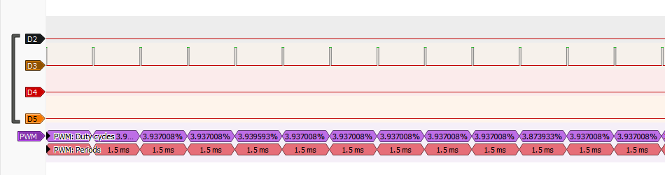
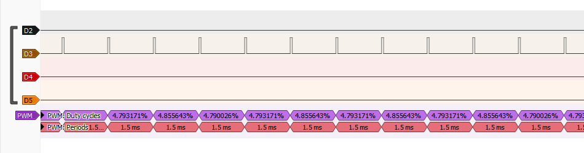
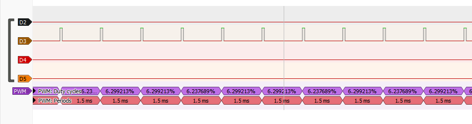
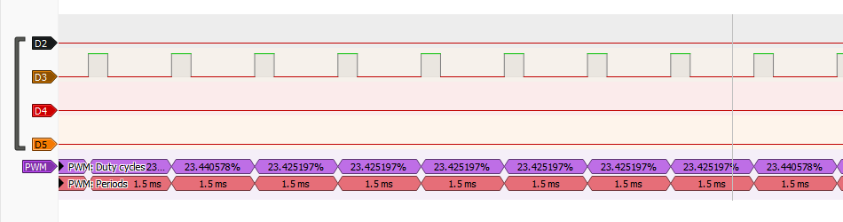

## What is this?

My attempt at reverse engineering the CaiXianlin shocker.

Please Note: these schematics are accurate for the following board revisions:
* remote: H-880V-TX-V1.0
* shocker: H-880B-RX-V2.0

## Shock pwm captures

The transformer is switched at a fixed frequency of 666 hz.

It uses a pwm signal with a duty cycle between 3.94% and 29.99%.

The following images are screenshots of sigrok captures at various percentages of intensity.

Note: You can view the captures for yourself using PulseView, they are in the "sigrok captures" folder of this repo.

1% Capture

5% Capture

10% Capture

25% Capture

50% Capture

75% Capture

100% Capture

